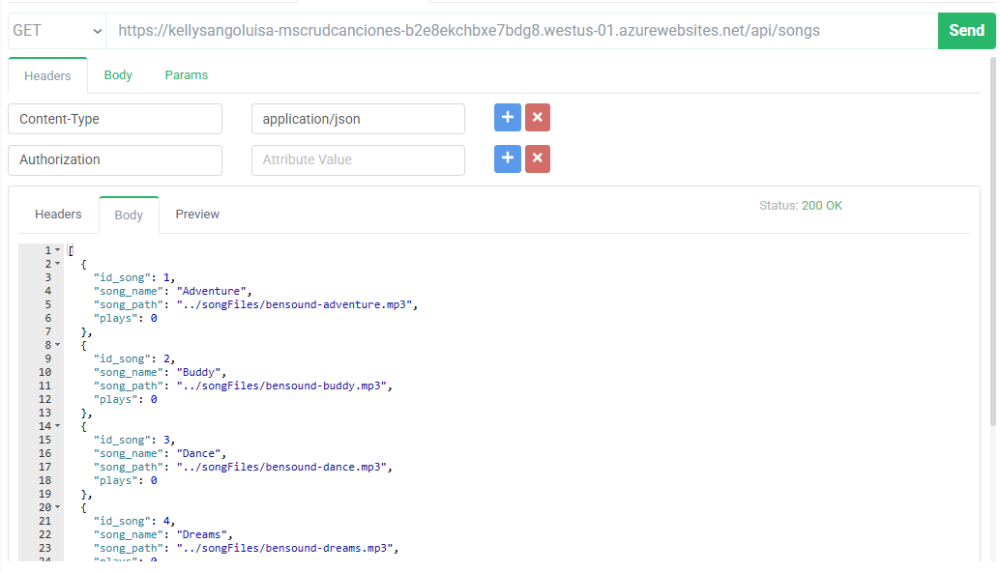
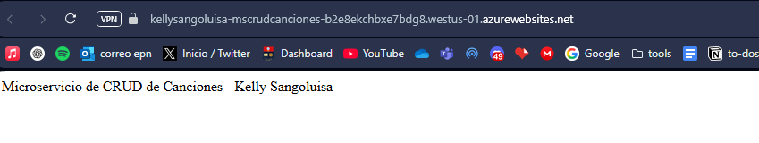

# polimusic-mscanciones

Microservicio CRUD de canciones desarrollado por Kelly Sangoluisa.

El microservicio está desplegado en Azure y disponible en:

**[https://kellysangoluisa-mscrudcanciones-b2e8ekchbxe7bdg8.westus-01.azurewebsites.net](https://kellysangoluisa-mscrudcanciones-b2e8ekchbxe7bdg8.westus-01.azurewebsites.net)**

- Endpoint principal: `/api/songs`
- Ejemplo: [https://kellysangoluisa-mscrudcanciones-b2e8ekchbxe7bdg8.westus-01.azurewebsites.net/api/songs](https://kellysangoluisa-mscrudcanciones-b2e8ekchbxe7bdg8.westus-01.azurewebsites.net/api/songs)

---

## 🚀 ¿Cómo correrlo localmente?

### 1. Clona el repositorio

```sh
git clone https://github.com/kelly-sangoluisa/polimusic-mscanciones.git
cd polimusic-mscanciones
```

### 2. Crea un archivo `.env` con las siguientes variables:

```env
SUPABASE_URL=https://ejemplo.supabase.co
SUPABASE_KEY=<TU_SUPABASE_KEY>
PORT=3000
```

### 3. Construye y ejecuta el contenedor con Docker

```sh
docker build -t polimusic-mscanciones:latest .
docker run --env-file .env -p 3000:3000 polimusic-mscanciones:latest
```

- El microservicio estará disponible en [http://localhost:3000/api/songs](http://localhost:3000/api/songs)

---

## 🐳 Docker Compose (rama funcional-local)

En la rama ` ms-funcional-local` puedes usar Docker Compose para levantar el microservicio y base de datos local:

```sh
docker-compose up --build
```

---

## ☁️ Despliegue en Azure

- La imagen Docker fue construida desde este repositorio y subida a Azure Container Registry (ACR).
- El despliegue se realizó en **Azure Web App for Containers**.
- Las variables de entorno (`SUPABASE_URL`, `SUPABASE_KEY`, `PORT`) se configuraron desde el portal de Azure.

 https://kellysangoluisa-mscrudcanciones-b2e8ekchbxe7bdg8.westus-01.azurewebsites.net 
---

## 📚 Endpoints principales

- `GET    /api/songs`         - Lista todas las canciones
- `GET    /api/songs/:id`     - Obtiene una canción por ID
- `POST   /api/songs`         - Crea una nueva canción
- `PUT    /api/songs/:id`     - Actualiza una canción existente
- `DELETE /api/songs/:id`     - Elimina una canción por ID

---

## 📝 Notas

- El código fuente está en la rama principal; la rama `funcional-local` es para pruebas locales con Docker Compose.

---

## 👩‍💻 Autor

Kelly Sangoluisa

---
